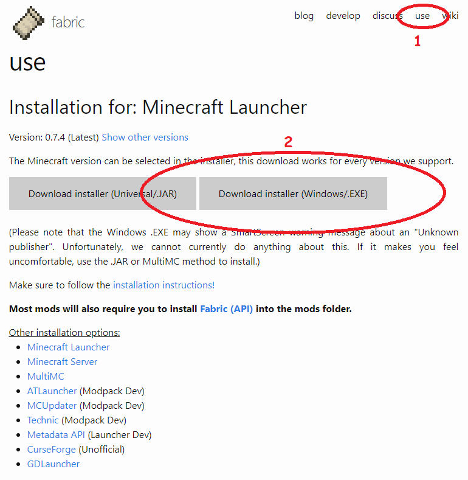
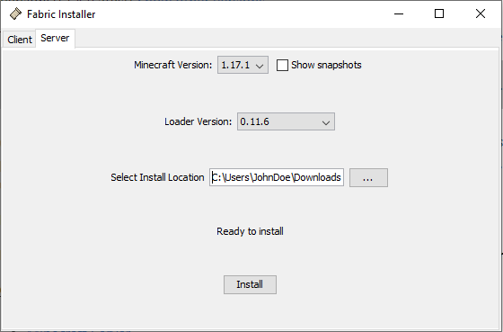
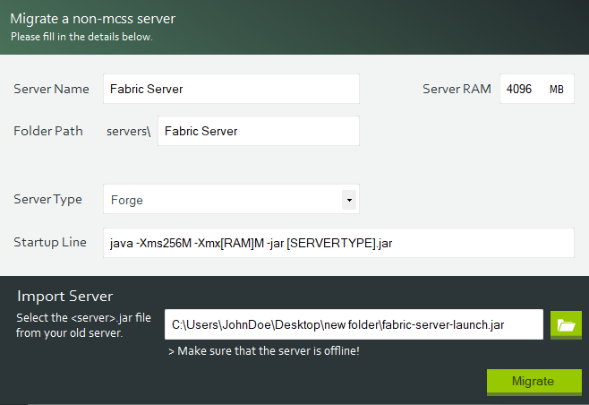

# Create a Fabric server

---

## Download Fabric

Go to the [Fabric website](https://fabricmc.net/) and choose the version that you want to download. Click on "Installer" to download that version's installer.

A .exe file will be downloaded, you might need to confirm the download on some browsers.

## Create the Fabric server

Once the download is done, open the file `fabric-installer-<fabric-version>.jar` to begin the Fabric server installation.  
Choose "install server" and select an empty folder in which the server will temporarily be installed (it will then be moved to the MCSS folder) and click OK. All the required files will be downloaded and placed in the selected folder. It'll ask for the official Minecraft Server jar to be downloaded, this can be done pressing the prompted window

The folder now contains : 

*   A sub-folder `.fabric-installer`
*   A file `fabric-server-launch.jar`
*   A file `server.jar`

You can now delete the fabric installer file.

## Migrate the server to MCSS

Now, open MCSS and go to "File > migrate server". A new windows will open. Inside it, choose a name for you server and a folder name (that will be stored to `mcss/servers/<folder_name>`. Choose the amout of RAM that will be allocated to the server, in MB (it's recommended to have at least 4GB, or 4096MB, for a server). 
In "server type" choose Forge. Finally, select the executable jar file of the server : it's the `fabric-server-launch.jar` file of the server you created in the steps above and click "Migrate". Do not change the Startup Line if you don't know what you're doing, or MCSS will break and your server won't work properly. 
All the server files are copied to the /servers folder of MCSS and your server will appear in the servers list.  

You can also delete the temporary folder where you installed Fabric, it is now useless since all the files have been copied to the /servers folder of the app.

You can now start you Fabric server by clicking the "Start" button.  
At the first server start, the console will show an error asking you to accept the EULA. To do so, click on "servers > show in file explorer" and open the "eula.txt" file. Change the line `eula=false` to `eula=true` and start the server again.  
this time, it will fully start and you will be able to connect from you Minecraft client.  
 
 
Much thanks to Kennas for making this wonderful video on how to install Fabric on MCSS: 
<iframe width="1280" height="720" src="https://www.youtube.com/embed/yHd5OAl8L9c" title="YouTube video player" frameborder="0" allow="accelerometer; autoplay; clipboard-write; encrypted-media; gyroscope; picture-in-picture" allowfullscreen></iframe>

