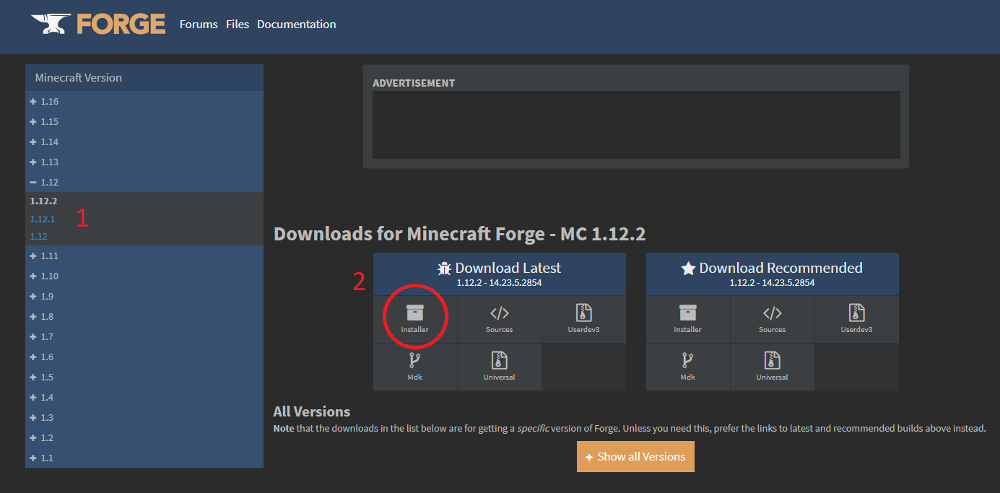
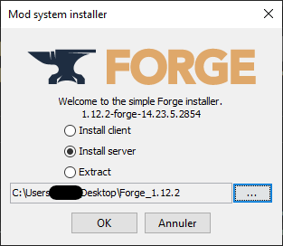
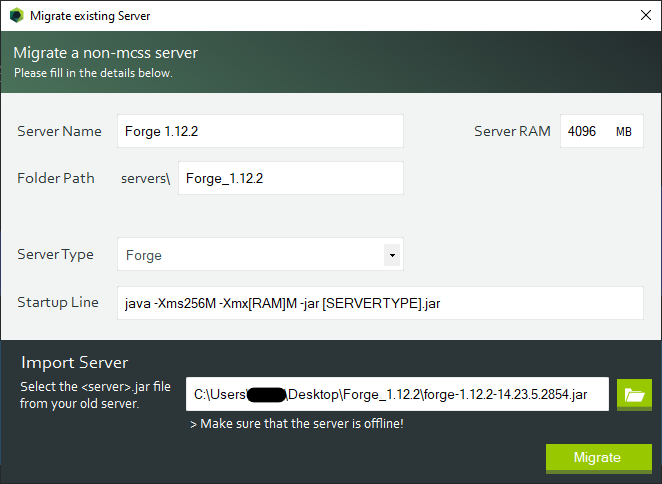

# Créer un serveur Forge

---

*   [Download Forge](#download-forge)
*   [Create the Forge server](#create-forge-server)
*   [Migrate the server to MCSS](#migrate-server)

## Download Forge

Go to the [Forge website](https://files.minecraftforge.net) and choose the version that you want to download. Click on "Installer" to download that version's installer.

Wait for the end of the ad (6 seconds) and click on "Skip" at the top right of the page. A .jar file will be downloaded.

## Create the Forge server

Once the download is done, open the file `forge-<version_minecraft>-<version_forge>-installer.jar` to begin the Forge server installation.  
Choose 'install server" and select an empty folder in which the server wil temporarily be installed (it will then be oved to the MCSS folder) and click OK. All the required files will be downloaded and placed in the selected folder.

The folder now contains : 
*   Un sub-folder `libraries`
*   Un file `<version_minecraft>.json`
*   Un file `forge-<version_minecraft>-<version_forge>.jar`
*   Un file `minecraft-server.<version_minecraft>.jar`

You can now delete the forge installer file.

## Migrate the server to MCSS

Now, open MCSS and go to "File > migrate server. A new windows will open. Inside it, choose a name for you server and a folder name (that will be stored to `mcss/servers/<folder_name>`. Choose the amout of RAM that will be allocated to the server, in MB (it's recommended to have at least 4GB for a Forge server). 
In "server type" choose Forge. Finally, select the executable jar file of the server : it's the `forge-<version_minecraft>-<version_forge>.jar` file of the server you created in the steps above and click "Migrate".  
All the server files are copied to the /servers folder of MCSS and your server will appear in the servers list.  

You can also delete the temporary folder where you installed Forge, it is useless since all the files have been copied to the /servers folder of the app.

You can now start you Forge server by clicking the "Start" button.  
At the first server start, the console will show an error asking you to accept the EULA. To do so, click on "servers > show in file explorer" and open the "eula.txt" file. Change the line `eula=false` to `eula=true` and start the server again.  
this time, it will fully start and you will b eable to connect from you Minecraft client.

