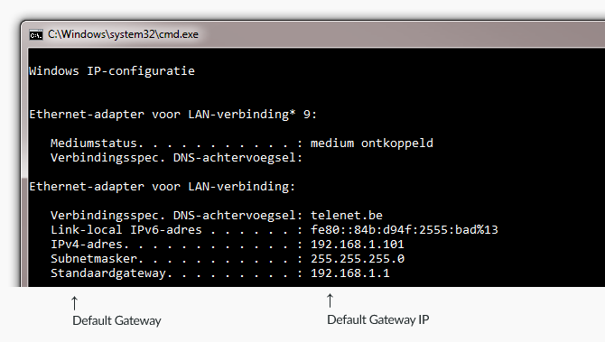
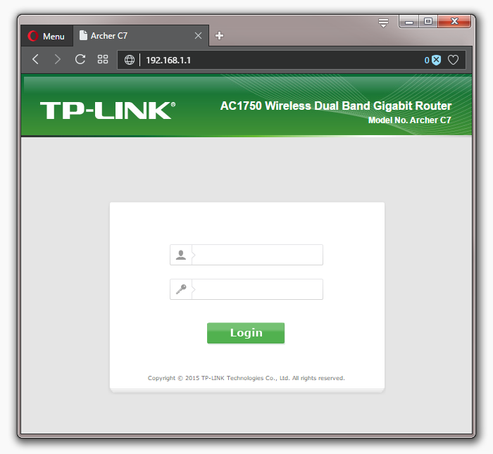

# La redirection de port

---

*   [Introduction](#introduction)
*   [Plusieurs types d'équipements réseau](#different-network-devices)
*   [Acceder à l'interface web de votre routeur/modem](#accessing-your-router-modem-web-interface)
*   [Mettre en place la redirection de port](#setting-up-the-port-forward)

## Introduction

J'aurais pu écrire un tutoriel pour ouvrir un port de A à Z, mais à la fin vous auriez fait des choses sans même savoir à quoi elles correspondent. Résoudre les problèmes et maintenir votre réseau serait difficile et long. Dans ce guide, nous allons nous concentrer sur la redirection de port et la logique de base qui se cache derrière.

La redirection de port, ou ouverture de port, n'est vraiment pas si difficile qu'il n'y paraît. Le but d'une redirection de port est de rendre accessible un logiciel spécifique de votre ordinateur depuis Internet. Ce procédé est utilisé communément pour des serveurs de jeu, des échanges peer-to-peer ou des applications voix-ip par exemple.

Ce n'est pas quelque chose que vous allez mettre en place sur votre PC directement, mais sur l'interface web de votre routeur et/or modem. Dans la plupart des cas (en France), les modems contiennent aussi un routeur intégré, donc il n'y aura qu'un seul appareil à configurer.

Dans mon cas, j'ai désactivé la fonction routeur de mon modem et j'y ai relié un routeur plus puissant. Je devrais donc ouvrir un port sur les deux appareils (modem et routeur externe).

Comme vous pouvez le voir, ça peut devenir un peu déroutant si vous ne savez pas comment est organisé votre réseau.

## Plusieurs types d'équipements réseau

Dans un réseau, vosu êtes susceptibles de trouver ces appareils :

Appareil | Description
--- | ---
Modem | Il est le plus souvent fourni par votre Fournisseur d'Acces à Internet (FAI). En termes simples : il permet de recevoir et d'envoyer les données nécessaires pour votre connexion internet/téléphone/TV.
Routeur | A device that creates a network between the computers in your home by wire or wifi. Many internet provider install modems with an built-in router. (with or without wireless capabilities)
Switch | Looks the same as a router but it does less. You would use a switch to expand your network, *ex. 1 cable goes in, 3 cables go elsewhere.*
Hub | Honestly, throw this thing away. Hubs are very old, they are the switches of the past. All they do is receive signals and forward them to all connected devices. They add unneeded latency and noise on the network. Just want to point out that it would be a good time to upgrade to a switch.

So go ahead and look arround to see how your network is setup.

## Accessing your router/modem's web interface

Now that you have a good sense on which router/modem you are running behind. It's finally time to connect to the machine that you want to configure.

### Step 1: Find the ip of the modem/device (default gateway)

Open up a command line prompt, you can do this by pressing `Windows Key + R` and type `cmd` and hit `Enter`. Or you can search for `Command Prompt` under your apps.

Type <var>ipconfig</var> and hit <kbd>Enter</kbd>.

This is my result, it will look different but the layout is more or less the same. What we need it the IP address of the ***Default Gateway***.

Open a browser and type that into the address bar.

## Setting up the port forward

Every manufacturer has its own interface, so they look all different. It would be impossible for me to cover all of them and continuing would be useless for all the people who don't own a TP-Link router with this model.

Instead I'm going to refer you to [www.portforward.com/router.htm](https://portforward.com/router.htm), they have over hundreds of tutorials for almost every brand and model.

I hope this guide has been somewhat useful to you, good luck!
