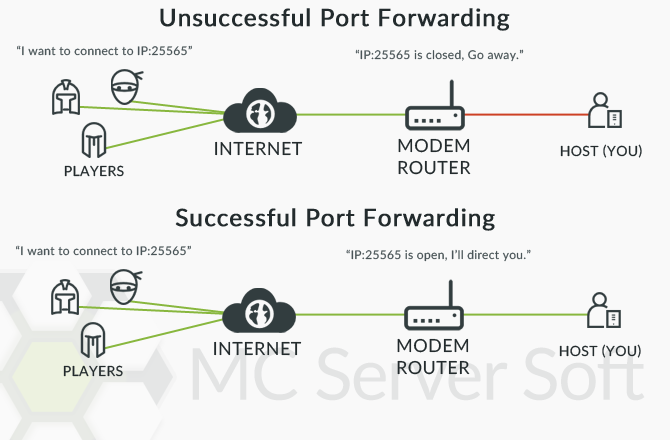

# Port forwarding

---

## Introduction

I could have just written an A to Z tutorial but at the end of the day you would still have no idea what you actually did. Troubleshooting problems and maintaining your network would be tricky and painfull. So in this guide I'll be focusing on port forwarding and the basic logic arround it.

Port forwarding or port mapping isn't that difficult, it might look complicated at first but it really isn't. The pupose of port forwarding is to make a specific programs on your computer accessible to other computers on the internet. It is commonly used for hosting game servers, peer-to-peer transfers, voice-over-ip applications and much more.

It isn't something you need to configure on your computer but in your modem's and/or router's web interface. In most household networks the modem contains a router with wireless capability and everything is hooked up to that. So in that case you would only need to change the settings in the modem itself.

In my case, I have a modem with the wireless features turned off and I've hooked up a more powerful router to the modem. So I will need to portforward the modem and the external router.

As you can see it becomes a bit confusing, if you don't know how your network is setup.

## Different network devices

In any network you might find one of these devices:

Device | Description
--- | ---
Modem | This is usually provided by your internet service provider, ISP for short. Simply put: it provides a way to recieve and send data needed for your telephone, TV and internet connection.
Router | A device that creates a network between the computers in your home by wire or wifi. Many internet provider install modems with an built-in router. (with or without wireless capabilities)
Switch | Looks the same as a router but it does less. You would use a switch to expand your network, *ex. 1 cable goes in, 3 cables go elsewhere.*
Hub | Honestly, throw this thing away. Hubs are very old, they are the switches of the past. All they do is receive signals and forward them to all connected devices. They add unneeded latency and noise on the network. Just want to point out that it would be a good time to upgrade to a switch.

So go ahead and look arround to see how your network is setup.

## Accessing your router/modem's web interface

Now that you have a good sense on which router/modem you are running behind. It's finally time to connect to the machine that you want to configure.

### Step 1: Find the ip of the modem/device (default gateway)

Open up a command line prompt, you can do this by pressing `Windows Key + R` and type `cmd` and hit `Enter`. Or you can search for `Command Prompt` under your apps.

Type <var>ipconfig</var> and hit <kbd>Enter</kbd>.

This is my result, it will look different but the layout is more or less the same. What we need it the IP address of the ***Default Gateway***.

Open a browser and type that into the address bar.

## Setting up the port forward

Every manufacturer has its own interface, so they look all different. It would be impossible for me to cover all of them and continuing would be useless for all the people who don't own a TP-Link router with this model.

Instead I'm going to refer you to [www.portforward.com/router.htm](https://portforward.com/router.htm), they have over hundreds of tutorials for almost every brand and model.

I hope this guide has been somewhat useful to you, good luck!
